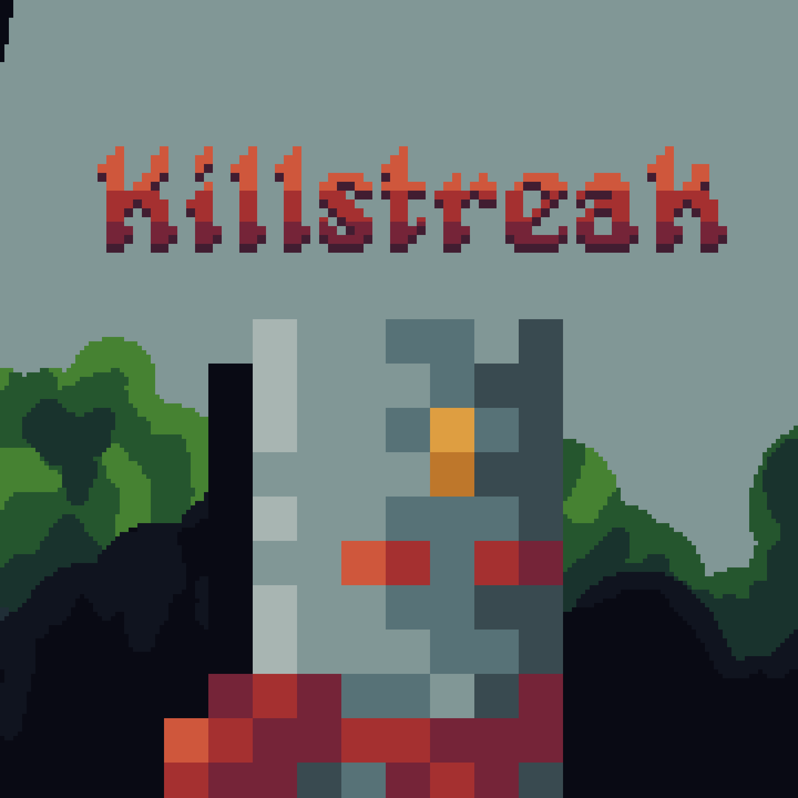

# Killstreak

Killstreak is a shooter platformer created during [Ludum Dare](https://ldjam.com) 54 edition.

The game was created using Godot 4.1.x and is available to play on the [Itch Webpage](https://4wiru.itch.io/killstreak)

The source code is entirely available in this repository. Further development on the game might happen but it's not planned.

## Controls
* WASD or Controller to move
* Ctrl or Circle on Controller to Dash
* Left Click or Square on Controller to fire
* Space or X on Controller to jump
	* Pressing space again makes you double jump
* Moving agains a wall make you wallslide
* Esc to open settings

## Credits

Pretty much everything on the game was created only by myself, the art, coding, level design. The only outsourced resource is the musich, which was done by [@FreeMusicc](https://www.youtube.com/@FreeMusicc) on youtube

## LD Submission

You can check the [LD Submission here](https://ldjam.com/events/ludum-dare/54/killstreak).

Thank you for reading, and I hope you have fun!
